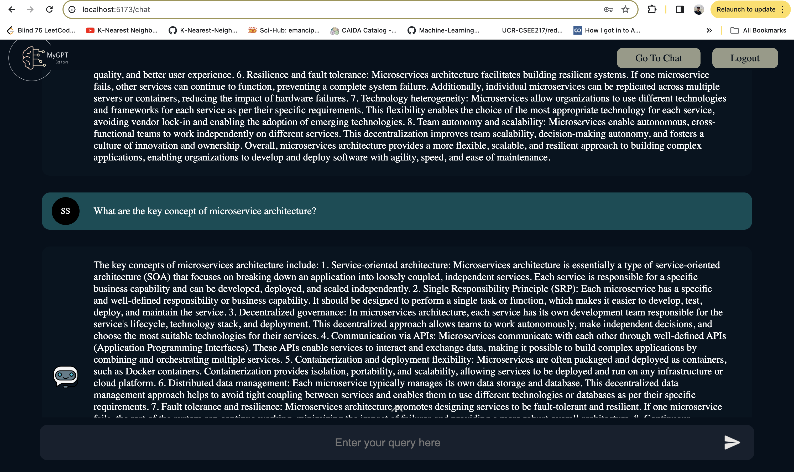

# MyGPT Chat Assistant

MyGPT is a custom AI chat assistant that leverages OpenAI's powerful GPT-3.5 language model. This project includes a frontend built with React, a backend powered by Node.js, and integration with OpenAI for natural language understanding and generation.

## Table of Contents

- [Introduction](#introduction)
- [Features](#features)
- [Installation](#installation)
- [Configuration](#configuration)
- [Usage](#usage)
- [Contributing](#contributing)
- [License](#license)

## Introduction

MyGPT is designed to provide a seamless and interactive chat experience by utilizing the advanced capabilities of OpenAI's GPT-3.5. The frontend, developed with React, offers a user-friendly interface, while the Node.js backend manages communication with OpenAI's API.

## Features

- **Real-time Chat**: Engage in dynamic and real-time conversations with MyGPT.
- **Customizable Responses**: Configure the model to generate responses based on specific contexts or requirements.
- **User-friendly Interface**: The React-based frontend ensures a smooth and intuitive user experience.
- **Scalable Architecture**: The Node.js backend is scalable and can handle multiple concurrent requests.

## Installation

1. Clone the repository:

   ```bash
   git clone https://github.com/your-username/mygpt-chat-assistant.git

   cd mygpt-chat-assistant


2. Navigate to the project directory:
    ```bash
    cd mygpt-chat-assistant
3. Install dependencies for both frontend and backend:

    ```bash
    # Install frontend dependencies
    cd frontend
    npm install

    # Install backend dependencies
    cd ../backend
    npm install

## Configuration
Before running the application, configure the necessary settings.

### Frontend Configuration

### Backend Configuration

1. Open backend/.env and set the backend configuration:

    ```bash 
    PORT=   
    MONGO_USER=
    MONGO_PASSWORD=
    MONGO_URL=
    OPEN_AI_SECRET_KEY=
    OPEN_AI_ORG=
    JWT_SECRET=
    COOKIE_SECRET=abcd
    DOMAIN=localhost
2. Setup the mongodb connection string in index.ts:
    ```bash
    #Below is the code snippit change the string inside the Connect method 
        mongoose
	.connect(
		`mongodb+srv://<Username>:<Password>@cluster0.aqm33es.mongodb.net/MyGPT`
	)
	.then(() => {
		app.listen(process.env.PORT || 5000);
		console.log(
			`Server started on port ${
				process.env.PORT || 5000
			} and Mongo DB is connected`
		);
	})
	.catch((err) => {
		console.log(err);
	});


## Usage

1. Start the backend server:
    ```bash
    cd backend
    npm start

2. In a separate terminal, start the frontend:
    ```bash
    cd frontend
    npm start
3. Open your browser and navigate to http://localhost:5173 to interact with MyGPT.


## Platform 




